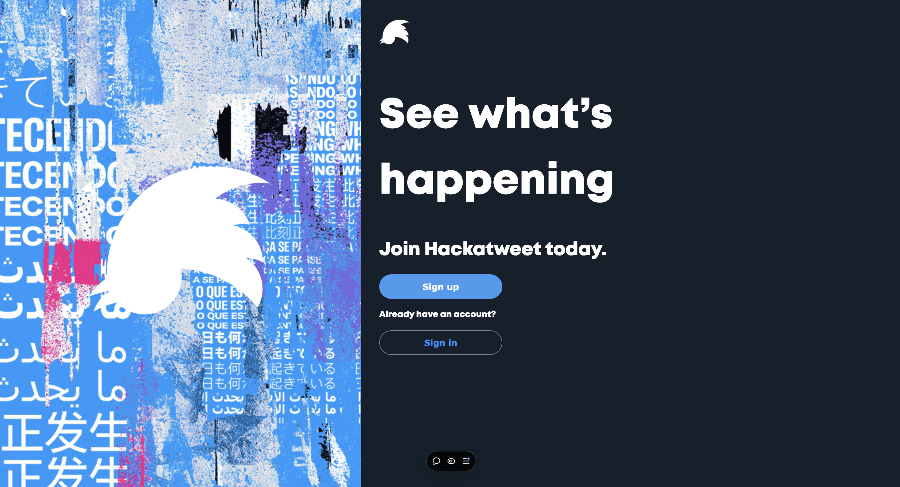

# Hack a Tweet

**Hack a Tweet** is a full-stack web app that replicates core Twitter functionalities. Users can sign up, sign in, post tweets, and interact with other users' content.

## Live Demo

Visit the live application at: [https://hackatweet-vinesk.vercel.app](https://hackatweet-vinesk.vercel.app)

## Features

- **User Authentication**: Sign up, sign in, log out.
- **Tweet Creation**: Post tweets up to 280 characters.
- **Hashtags**: Use and track trending hashtags.
- **Interactions**: Like and delete tweets.
- **Dynamic Routing**: Hashtag-specific pages.
- **Secure Auth**: Password hashing, tokens.
- **Persistent Store**: Remain logged in after page refresh.

## Tech Stack

**Frontend**: React, Next.js, Redux  
**Backend**: Node.js, Express, MongoDB  
**Deployment**: Vercel

## Project Structure

```
hackatweet/
├── frontend/          # Next.js frontend
├── backend/           # Express backend
└── package.json       # Root package.json with workspaces
```

## Setup

1. Clone the repository:

   ```bash
   git clone https://github.com/vinesk/hackatweet.git
   cd hackatweet
   ```

2. Install dependencies:

   ```bash
   yarn install
   ```

3. Set up environment variables:

   Frontend (.env.local in frontend folder):

   ```bash
   NEXT_PUBLIC_BACKEND_URL=https://your-backend-url
   ```

   Backend (.env in backend folder):

   ```bash
   CONNECTION_STRING=your-mongodb-uri
   FRONTEND_URL="http://your-frontend-url"
   ```

4. Start development servers:

   ```bash
   # Start both frontend and backend
   yarn dev

   # Or start them separately
   yarn workspace frontend dev
   yarn workspace backend start
   ```

## Usage

- **Home Page**: View and post tweets, see trending hashtags.
- **Tweet**: Create tweets up to 280 characters.
- **Interact**: Like tweets, delete your own tweets.
- **Hashtags**: Click on trending hashtags to view related tweets.
- **Search**: Use the search bar on hashtag pages to find specific hashtags.

## Development

- Frontend runs on: `http://localhost:3001`
- Backend runs on: `http://localhost:3000`

## License

MIT License. See the [LICENSE](./LICENSE) file for details.
